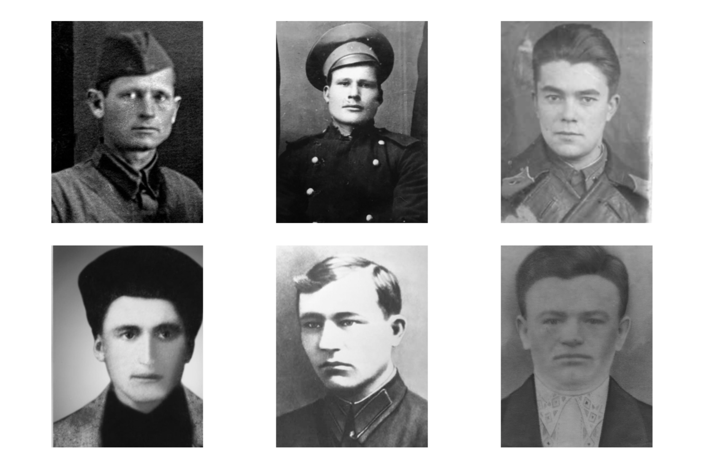

# Eastern Front Dataset (WWII)

This repo contains details about the USSR Eastern Front WWII veterans dataset extracted from the [Pamyat Naroda](https://foto.pamyat-naroda.ru) website.

Data contains about 1.1 million records about veterans, including personal information and information about the military service. More than half of the records contain photos (provided as direct URL).

`EDA and Processing.ipynb` notebook for quick analysis and some data processing provided. `data.csv.zip` contains raw data, `data_processed.csv.zip` contains data with cleaned dates (result of notebook run).

This data is used to create [Greetings From The Past](https://greetingsfromthepast.net) demo. Animation of WWII (Eastern Front) casualties.

At the moment of data downloading (and at the time of the last viewing), auto scrapping was not prohibited by the source website. We don't use this data for any commercial purpose (only for popularization) and provide all required links to the data sources.
